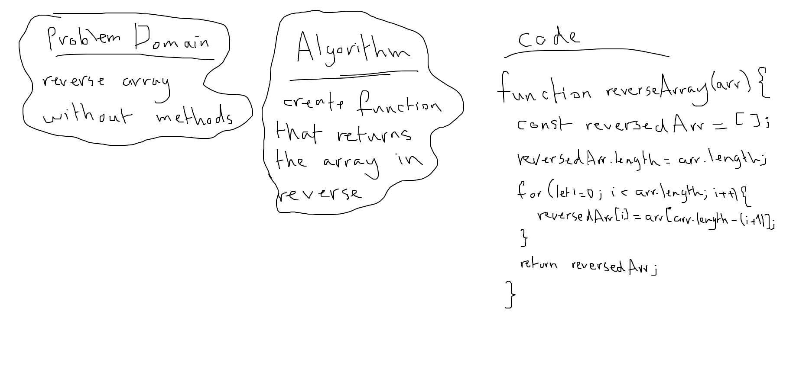

# Data Structures and Algorithms

See [setup instructions](https://codefellows.github.io/setup-guide/code-301/3-code-challenges), in the Code 301 Setup Guide.

## Repository Quick Tour and Usage

### 301 Code Challenges

Under the `data-structures-and-algorithms` repository, at the top level is a folder called `code-challenges`

Each day, you'll add one new file to this folder to do your work for the day's assigned code challenge

---

### 401 Data Structures, Code Challenges

---

[**Reverse an Array**](./code-challenges/arrayReverse/array-reverse.test.js)

**Challenge**: Array should be reversed without utilizing built-in methods, while applying our own testing code

**Approach & Efficiency**: I tried using the most basic code; a basic for loop and unshifting the values

**Solution**:

*run: npm test array-reverse*

