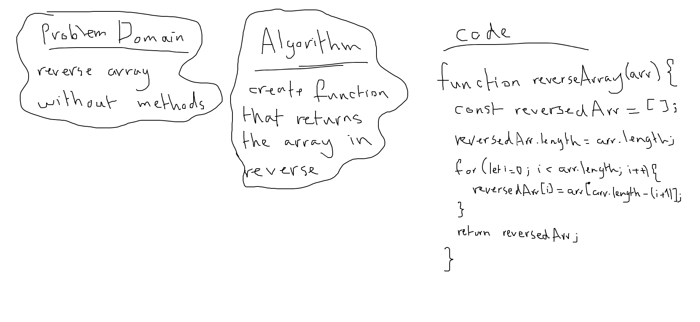

# Array Reverse

[**Reverse an Array**](./array-reverse.js)

**Challenge**: Array should be reversed without utilizing built-in methods, while applying our own testing code

**Approach & Efficiency**: I copied the array by value not reference so that the original array stays immutable, then I reassigned the values of the new array by index in a for loop as such `reversedArr[i] = arr[arr.length - (i + 1)]`, so that the values are reversed.

**Solution**:

*run: npm test array-reverse*

