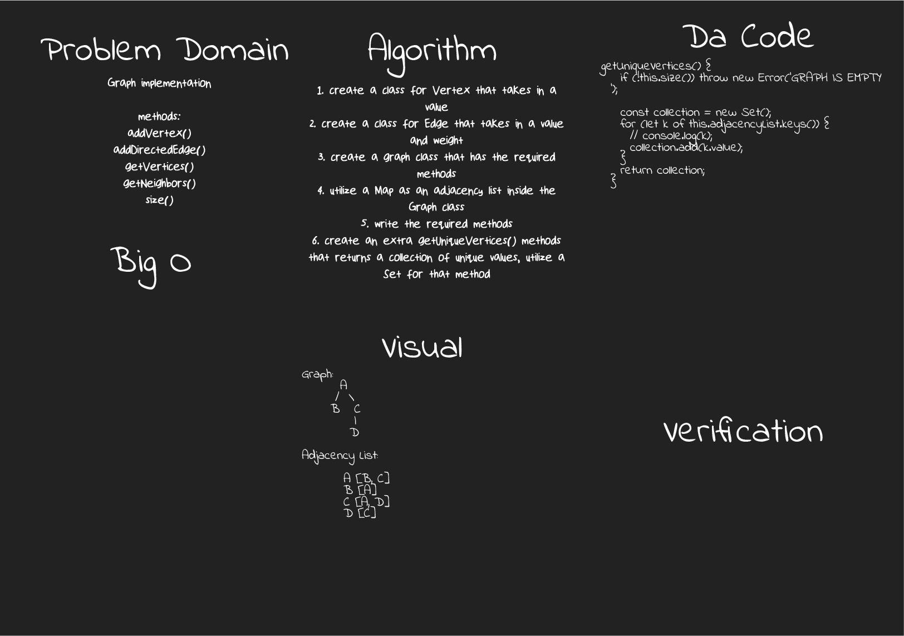

# Graph

[**Graph**](./graph.js)

**Challenge**:
- Implement a **Graph** with the following methods
  - addVertex()
  - addDirectedEdge()
  - getVertices()
  - getNeighbors()
  - size()
  - Extra methods:
    - getUniqueVertices()
  - bfs() -> or simply breadth-first traversal

**Approach & Efficiency**: 
- A separate `Vertex` and `Edge` class were created
- A `Map` was utilized to represent the **adjacency list** inside the `graph` class
- For `bfs`, a queue and a while loop did the trick, and a `Set` was crucial to prevent infinite looping 😎

**Solution**:

*run: npm test graph*

- The visual example below is for an undirected graph (bidirectional)

