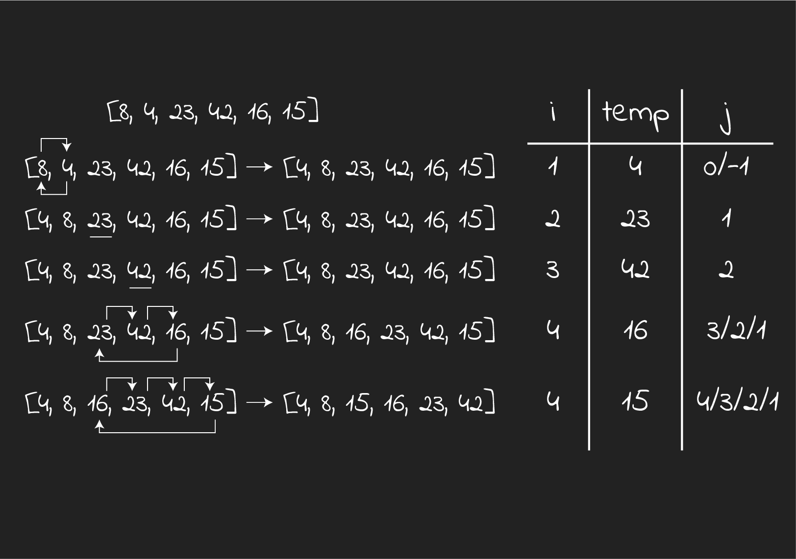

# insertionSort

Insertion Sort is a sorting algorithm

- It stores the current element in a temporary variable
- Compares it with its previous element and does the sorting that way
- This algorithm does not require traversing the whole array to begin sorting, it sorts each element as it reaches it

---

## Pseudocode

```
InsertionSort(int[] arr)

  FOR i = 1 to arr.length

    int j <-- i - 1
    int temp <-- arr[i]

    WHILE j >= 0 AND temp < arr[j]
      arr[j + 1] <-- arr[j]
      j <-- j - 1

    arr[j + 1] <-- temp
```

---

## JavaScript

```javascript
function insertionSort(arr) {
  for (var i = 1; i < arr.length; i++) {
    // grabbing the current element
    let temp = arr[i];

    // the last sorted element
    let j = i - 1;

    while (j >= 0 && temp < arr[j]) {
      arr[j + 1] = arr[j];
      j = j - 1;
    }
    arr[j + 1] = temp;
  }
  return arr;
}
```

---

## Tracing



- **Pass 1**:
  - `temp` is `4`, so `8` will take its place, and `4` will be assigned to the first spot.

- **Pass 2**:
  - `23` is bigger than `8`, no changes will happen.

- **Pass 3**:
  - `42` is bigger than `23`, no changes will happen.

- **Pass 4**:
  - `16` is smaller than `42`, so `42` will take its place.
  - `16` is smaller than `23`, so `23` will proceed one index to the right, taking the previous spot of `42`.
  - `16` is assigned to the index of `23` which is 2.

- **Pass 5**:
  - `15` is smaller than `42`, so the same will happen as **pass 4** until `15` is placed before `16`.
