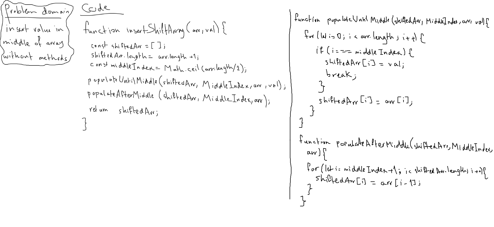

# Linked List

[**Linked List**](./linkeed-list.js)

**Challenge**: Create a linked list class which has methods to insert at head, find a node by value and print a collection of all the nodes in the linked list.

**Approach & Efficiency**: A class was created along with the methods... a helper function, `fromValues` was created to help in inserting multiple values at once for testing purposes and whatnot.

**Solution**:

*run: npm test linked-list*

