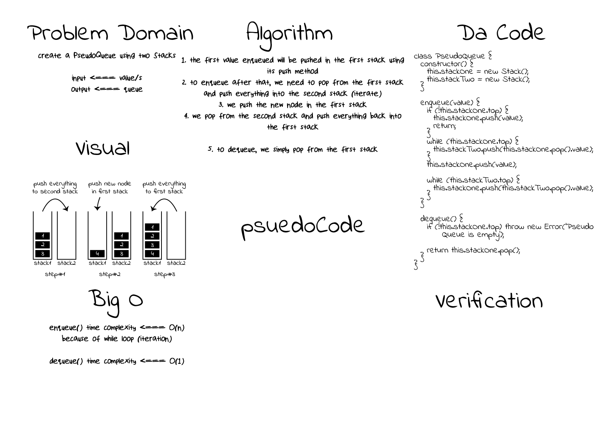

# Queue With Stacks

[**Queue With Stacks**](./queue-with-stacks.js)

**Challenge**:
- Create a `PseudoQueue` class using two `Stack` instances
  - The `PseudoQueue` should have `enqueue` and `dequeue` methods.
  - The two `Stack` instances can use `push` and `pop` methods.

**Approach & Efficiency**: The two `Stack` instances will work in alteration, meaning that the first `stack` will work as the main storage. Every time there is an `enqueue`, we will traverse the two stacks `popping` from the `first` and `pushing` into the `second`, then we add the new node in the `first stack`, then we `pop` all nodes from the `second stack` back to the `first stack`.

**Solution**:

*run: npm test queue-with-stacks*

