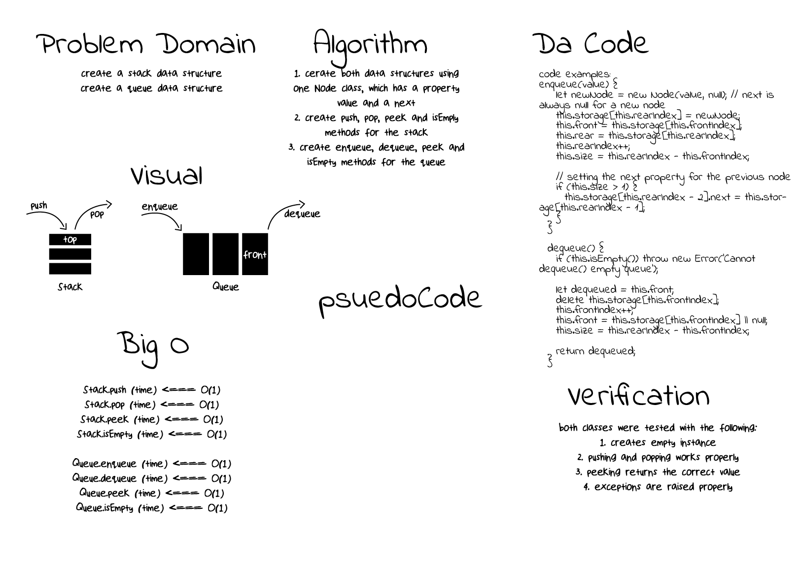

# Stacks And Queues

[**Stacks And Queues**](./stacks-and-queues.js)

**Challenge**:
- Create a `stack` class, and another `queues` class
  - The `stack` should have a `top` property
  - The `queue` should have a `front` property
  - Both should use one `Node` class
  - Both should have a `next` property in their nodes

**Approach & Efficiency**: The challenge leans toward a solution close to a `linked list`. I implemented the `stack` and the `queue` in that way. And I also added a `storage` property in case we do not want to rely on the `next` property. Time and space complexity of `O(1)` was achieved on all `methods` on both classes.

**Solution**:

*run: npm test stacks-and-queues*

