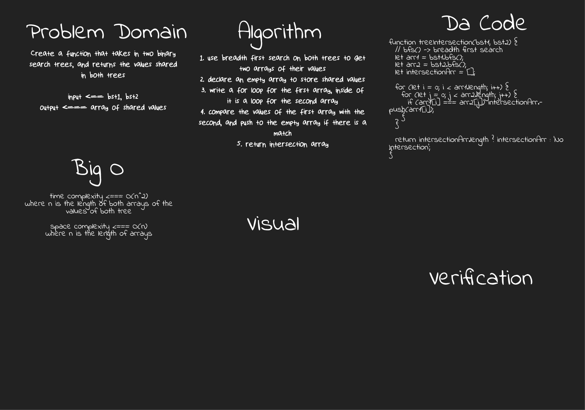

# Tree Intersection

[**Tree Intersection**](./tree-intersection.js)

**Challenge**:
- Create a function that takes in two binary search trees, and returns the values shared in both trees

**Approach & Efficiency**: 
- A hash table can be very efficient in this case
- Due to time constraints, a simpler less-efficient solution was adopted... using two for loops to find the intersection

**Solution**:

*run: npm test tree-intersection*

