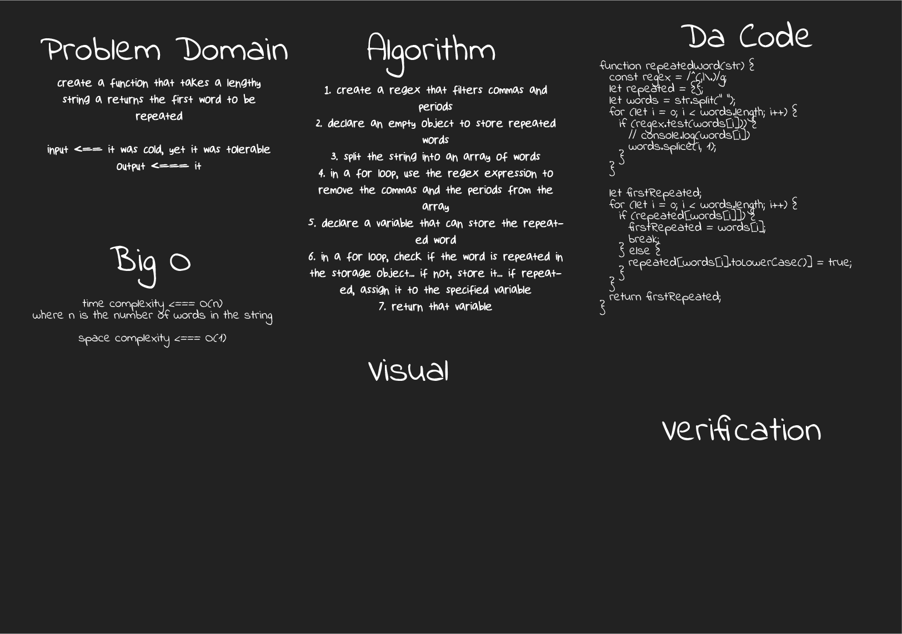

# Repeated Word

[**Repeated Word**](./repeated-word.js)

**Challenge**:
- Create a function that takes in a lengthy string, and returns the first word to be repeated

**Approach & Efficiency**: 
- regex and a for loop were used to find the result

**Solution**:

*run: npm test repeated-word*

